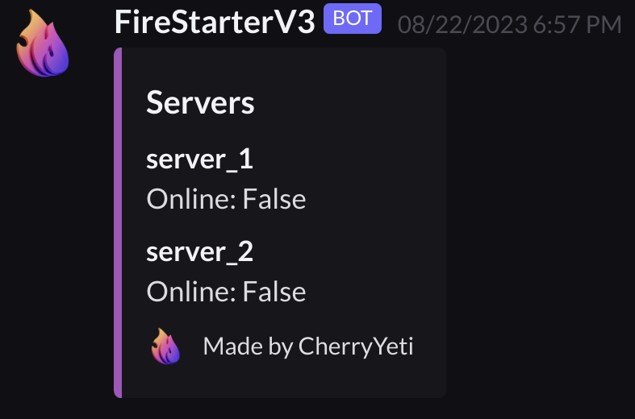
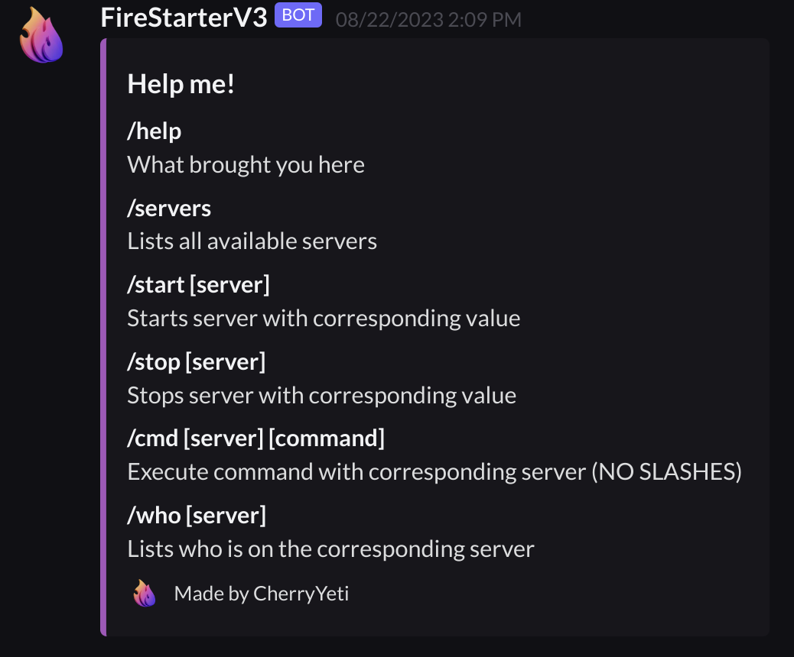

### Embed Template

```python
def generate_embed(title, fields):
    embed = nextcord.Embed(title=title, color=nextcord.Colour.purple())
    for name, value, inline in fields:
        embed.add_field(name=name, value=value, inline=inline)
    return embed
```

This function is a template for creating an embed, it takes in `title`, which is set to the title of the embed, and fields, an array of fields that are appended to the embed.

### Servers Embed

```python
def generate_servers_embed():
    fields = [(f'{server_name}', f'Online: {running}', False) for server_name, running in zip(config_yaml_contents["servers"].keys(), server_running)]
    servers_embed = generate_embed("Servers", fields)
    servers_embed.set_footer(text="Made by CherryYeti", icon_url="https://avatars.githubusercontent.com/u/53279269?v=4")
    return servers_embed
```

Here, we generate the embeds that list the servers. We extract the server name and whether or not it is running from the `config_yaml_contents`



### Help Embed

```python
def generate_help_embed():
    fields = [
        ("/help", "What brought you here", False),
        ("/servers", "Lists all available servers", False),
        ("/start [server]", "Starts server with corresponding value", False),
        ("/stop [server]", "Stops server with corresponding value", False),
        ("/cmd [server] [command]", "Execute command with corresponding server (NO SLASHES)", False),
        ("/who [server]", "Lists who is on the corresponding server", False)
    ]
    help_embed = generate_embed("Help me!", fields)
    help_embed.set_footer(text="Made by CherryYeti", icon_url="https://i.ibb.co/fS29xcV/fire.png")
    return help_embed
```

Here, we generate the embeds that lists all of the commands.


